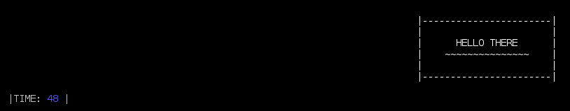

# txt-blit

> Draw lines of text onto other lines of text.

Handy low-level module that can be used for building
[choo](https://github.com/choojs/choo)-like apps for the terminal.

Combines nicely with [neat-log](https://github.com/joehand/neat-log) for
building reactive terminal apps.

Unicode code points of 0-2 fixed-width font cells are supported, to the extent
made possible by [wcswidth](https://github.com/timoxley/wcwidth).

# Usage: simple component

Let's make a reusable render component (a pure function that returns an array of
text lines) and draw it at different offsets:

```js
var blit = require('txt-blit')

function renderHelloBox () {
  return [
    '|-----------------------|',
    '|                       |',
    '|      HELLO THERE      |',
    '|    ~~~~~~~~~~~~~~~    |',
    '|                       |',
    '|-----------------------|',
  ]
}

var screen = []   // empty; blank screen

blit(screen, renderHelloBox(), 2, 2)
blit(screen, renderHelloBox(), 25, 10)
blit(screen, renderHelloBox(), 10, 7)

console.log(screen.join('\n'))
```

outputs

```


  |-----------------------|
  |                       |
  |      HELLO THERE      |
  |    ~~~~~~~~~~~~~~~    |
  |                       |
  |-------|-----------------------|
          |                       |
          |      HELLO THERE      |
          |    ~~~~~~~~~~~~~~~    |--------------|
          |                       |              |
          |-----------------------|LO THERE      |
                         |    ~~~~~~~~~~~~~~~    |
                         |                       |
                         |-----------------------|
```

## Usage: reactive terminal app

Let's combine txt-blit with [neat-log](https://github.com/joehand/neat-log) to
combine some dynamic components:

```js
var blit = require('.')
var neatLog = require('neat-log')
var chalk = require('chalk')

var app = neatLog(view)
app.use(countTheSeconds)

// update state
function countTheSeconds (state, bus) {
  state.seconds = 0
  setInterval(function () {
    state.seconds++
    bus.emit('render')
  }, 200)
}

// draw screen based on state
function view (state) {
  var screen = []

  // move hello-box in a sine wave
  var x = Math.floor(Math.sin(state.seconds / 5.0) * 10 + process.stdout.columns/2)
  blit(screen, renderHelloBox(), x, 3)

  // draw timer
  blit(screen, renderTimer(state), 10, 10)

  // dump screen string to standard out
  return screen.join('\n')
}

function renderHelloBox (state) {
  return [
    '|-----------------------|',
    '|                       |',
    '|      HELLO THERE      |',
    '|    ~~~~~~~~~~~~~~~    |',
    '|                       |',
    '|-----------------------|',
  ]
}

function renderTimer (state) {
  var colours = [
    chalk.black,
    chalk.red,
    chalk.green,
    chalk.yellow,
    chalk.blue,
    chalk.magenta,
    chalk.cyan,
    chalk.white,
    chalk.gray,
    chalk.redBright,
    chalk.greenBright,
    chalk.yellowBright,
    chalk.blueBright,
    chalk.magentaBright,
    chalk.cyanBright,
    chalk.whiteBright
  ]

  var colourize = colours[Math.floor(Math.random() * colours.length)]

  return [
    colours[7]('|TIME: ') + colourize(state.seconds) + colours[7](' |')
  ]
}

function renderHelloBox () {
  return [
    '|-----------------------|',
    '|                       |',
    '|      HELLO THERE      |',
    '|    ~~~~~~~~~~~~~~~    |',
    '|                       |',
    '|-----------------------|',
  ]
}

```

outputs something like



## API

```js
var blit = require('txt-blit')
```

### blit(screen, component, x, y)

Mutates the array of strings (lines) `screen` so that the array of strings
`component` is drawn at the offset `x, y`.

`blit` is smart enough to recognize ANSI escape codes (like colours) and compute
the correct offsets.

`blit` operates fastest if you pass in an array of lines for `screen`, but you
can also pass in a newline-delimited string and `blit` will split/re-join it for
you, though it will not be as fast.

## Install

With [npm](https://npmjs.org/) installed, run

```
$ npm install txt-blit
```

## License

ISC
